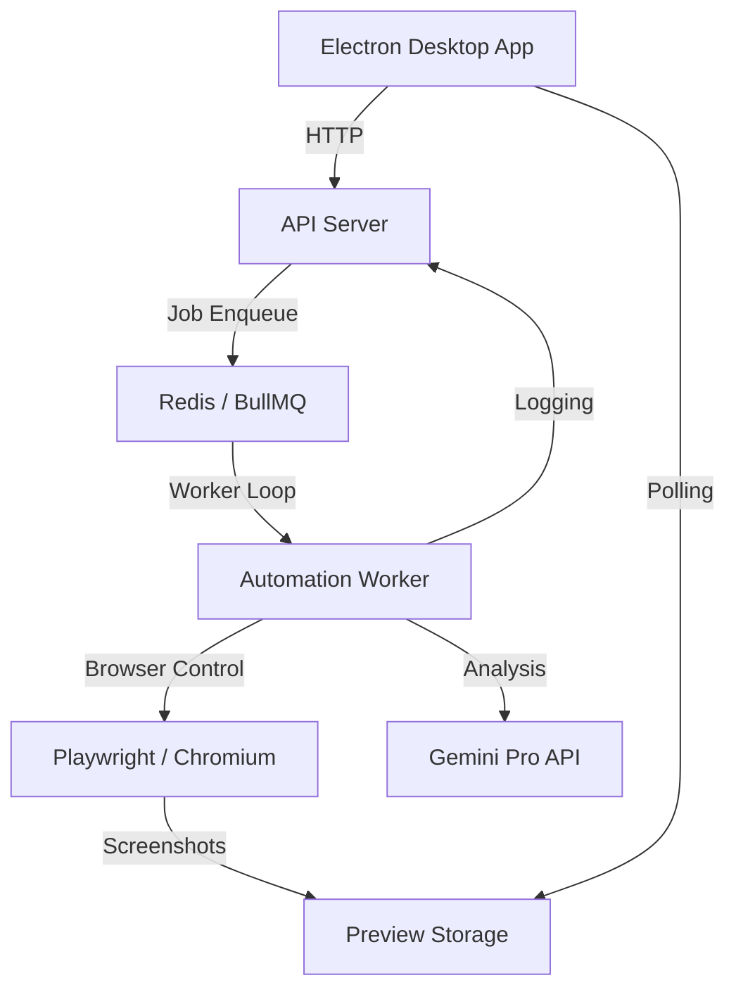

# Pipii AutoApply: AI-Powered Browser Automation

Pipii AutoApply is a state-of-the-art automated job application platform designed to handle complex, multi-page job forms using Playwright, Gemini AI, and a robust microservices architecture.

## 🚀 Key Features

- **Intelligent Form Filling**: Uses Google Gemini Pro/Flash to analyze DOM structures and intelligently map applicant data to complex form fields.
- **Shadow DOM Piercing**: Advanced selector engine capable of piercing through modern Web Components and Shadow DOMs (critical for platforms like Workday).
- **Live Automation Preview**: Real-time screenshot-based streaming allows users to watch the AI agent interact with the browser in the desktop application.
- **Native OS Dialog Interception**: Automatically handles custom file upload buttons by intercepting browser-level file-chooser events.
- **ATS-Optimized Resumes**: Dynamically generates and injects plain-text resumes into ATS systems to ensure 100% readability.
- **Human-Like Interaction**: Implements randomized typing delays, smooth scrolling, and aggressive overlay bypassing to mimic human behavior.

## 🛠 Tech Stack

| Component | Technology |
| :--- | :--- |
| **Monorepo** | PNPM Workspaces |
| **Desktop App** | Electron + React + Vite + Tailwind CSS |
| **Backend API** | Node.js + Express |
| **Automation Worker** | Node.js + Playwright + Gemini AI |
| **Task Queue** | BullMQ + Redis |
| **Communication**| Event-based state updates & Screenshot Polling |

## 🏗 System Architecture



## 📂 Project Structure

- `apps/desktop`: The Electron-based user interface.
- `apps/api`: Central orchestration server and database interface.
- `apps/worker`: The "brain" containing the automation logic and AI integration.
- `packages/`: Shared types and utilities across the monorepo.

## 🧠 Advanced Automation Logics

### 1. Shadow DOM Traversal
Many modern ATS systems (Workday, etc.) encapsulate their fields inside Shadow Roots. Our `querySelectorAllDeep` utility recursively traverses every element tree, ensuring no field is hidden from the AI agent.

### 2. Multi-Page Navigation Matrix
The worker handles complex page transitions by maintaining a state machine. It differentiates between:
- **Form analyzed**: Scanning the DOM.
- **Form filled**: AI mapped and executed inputs.
- **Waiting for navigation**: Detecting "Next" or "Continue" clicks.

### 3. Esbuild Reference Protection
The code uses advanced closure patterns and object-based namespaces to prevent build-time tools (like `tsx` or `esbuild`) from injecting metadata (like `__name`) that can crash the script inside the browser console.

## 🛠 Setup & Development

1. **Environment Variables**: Populate `.env` files in root and `apps/worker`.
   - `GEMINI_API_KEY`: Required for AI analysis.
   - `PLAYWRIGHT_HEADLESS`: Set to `false` for manual debugging.
2. **Installation**:
   ```bash
   pnpm install
   ```
3. **Execution**:
   ```bash
   pnpm dev
   ```

---
*Created by Antigravity AI*
