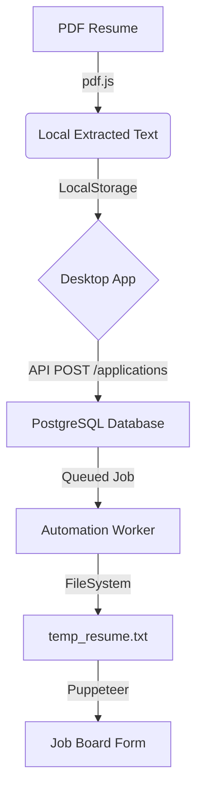

# User Data Handling & Storage

This document outlines how AutoApply manages, stores, and protects user information, profile data, and resume content across the desktop, API, and worker layers.

## 1. Storage Architecture

AutoApply uses a hybrid storage model to ensure high performance while maintaining data persistence across application runs.

| Storage Layer | Technology | Data Stored |
| :--- | :--- | :--- |
| **Frontend Local** | Browser LocalStorage | User Profile, Extracted Resume Text, JWT Tokens |
| **Remote Database** | PostgreSQL (via Prisma) | User Accounts, Application History, Metadata Snapshots |
| **Worker Local** | Filesystem (Node.js) | Temporary `.txt` resumes for browser upload |

---

## 2. The User Profile Lifecycle

### A. Local Profile (Frontend)
The primary "Source of Truth" for your data is your local browser environment.
- **Location**: `localStorage` (Keys: `autoapply_profile`, `autoapply_onboarding_profile`)
- **Content**: Includes full JSON structures for Education, Experience, Skills, and Social Links.
- **Privacy**: This data stays on your machine until you initiate a job application.

### B. Application Snapshots (API)
When you click **"Apply"**, the system takes a **snapshot** of your current profile.
- **Location**: `ApplicationRun` table (`checkpointJson` column).
- **Purpose**: Ensures that if you update your resume for a new job, the "already running" applications still use the version of the data they were started with.

### C. Resume Text handling
1. **Extraction**: Raw text is extracted from your PDF locally using `pdf.js`.
2. **Storage**: The full text is stored in `profile.resumeText` in LocalStorage.
3. **Execution**: During an application run, the Worker writes this text into a temporary file (`runtime/resumes/[application-id]/resume.txt`) so that the automated browser can "select" and upload it to the job portal.

---

## 3. Sensitive Data & Security

### Third-Party Credentials
If you provide credentials for job boards (e.g., LinkedIn, Indeed):
- **Storage**: `IntegrationCredential` table.
- **Security**: Passwords are **AES-256 encrypted** before database insertion and are only decrypted in-memory on the Worker during an active login attempt.

### EEO & Work Authorization
- **Data**: Race, gender, disability status, and visa requirements.
- **Handling**: These are stored as part of your profile and passed to the AI form filler to answer specific diversity and legal questions on application forms.

---

## 4. Data Flow Diagram

## 5. Data Cleanup
- **Worker Level**: The temporary `resume.txt` files are cleaned up after the application run succeeds or reaches its maximum retry limit.
- **Local Level**: Using the "Logout" or "Clear Profile" function in the Desktop app 100% purges all LocalStorage data.

---
> [!IMPORTANT]
> AutoApply prioritizes local-first storage. Your full resume text is never sent to our servers for "storage" unless it is attached to an active `ApplicationRun`.
